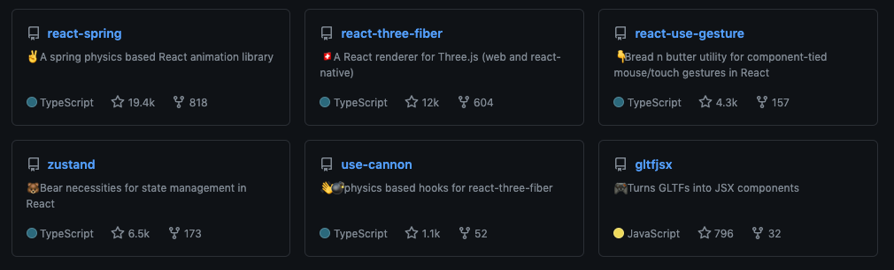
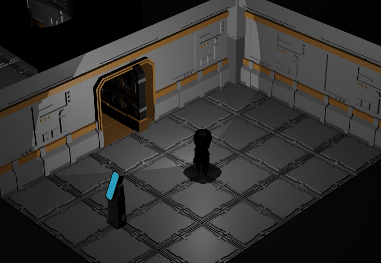

### Awesome React Three Fiber 

# Poimandres links

- [Official website](https://pmnd.rs/)
- [Github](https://github.com/pmndrs)
- [Twitter](https://twitter.com/pmndrs)
- [Poimandres twitter list](https://twitter.com/i/lists/1298304281397923845)
- [Discord](https://discord.gg/yhe4pWqx)

# Poimandres ecosystem libraries

## 3D

- [react-three-fiber](https://github.com/pmndrs/react-three-fiber)
- [react-three-next](https://github.com/pmndrs/react-three-next)
- [react-three-lightmap](https://github.com/pmndrs/react-three-lightmap)
- [react-postprocessing](https://github.com/react-spring/react-postprocessing)
- [react-three-a11y](https://github.com/pmndrs/react-three-a11y)
- [react-three-flex](https://github.com/pmndrs/react-three-flex)
- [drei](https://github.com/react-spring/drei)
- [react-xr](https://github.com/pmndrs/react-xr)
- [use-asset](https://github.com/pmndrs/use-asset)
- [component-material](https://github.com/pmndrs/component-material)
- [gltfjsx](https://github.com/pmndrs/gltfjsx)

## React tools

- [react-use-measure](https://github.com/pmndrs/react-use-measure)
- [react-spring](https://github.com/pmndrs/react-spring)
- [react-use-gesture](https://github.com/pmndrs/react-use-gesture)
- [leva](https://github.com/pmndrs/leva)

## State management

- [zustand](https://github.com/pmndrs/zustand)
- [jotai](https://github.com/pmndrs/jotai)
- [valtio](https://github.com/pmndrs/valtio)

## Physics

- [cannon-es](https://github.com/pmndrs/cannon-es)
- [use-cannon](https://github.com/pmndrs/use-cannon)

# Community ecosystem libraries

- [r3f-perf](https://github.com/RenaudRohlinger/r3f-perf)
- [three-material-editor](https://github.com/RenaudRohlinger/three-material-editor)
- [use-r3f-assets](https://github.com/emmelleppi/use-r3f-assets)

# Gamedev

- [react-three-game-starter](https://github.com/simonghales/react-three-game-starter)
- [react-three-game-engine](https://github.com/simonghales/react-three-game-engine)
- [react-three-game-example](https://github.com/simonghales/example-react-three-game)
- [r3f-game-demo](https://github.com/coldi/r3f-game-demo)
- [rgg](https://github.com/simonghales/rgg)

# Codesandbox links

- [Paul Hecnschel](https://codesandbox.io/u/drcmda)
- [Gianmarco](https://codesandbox.io/u/gsimone)
- [Marco Ludovico Perego](https://codesandbox.io/u/emmelleppi)
- [Curated collections](https://codesandbox.io/u/Flow11/likes)

# Github links

| Name            | Link                                               |
| --------------- | -------------------------------------------------- |
| r3f-raymarching | [link](https://github.com/gsimone/r3f-raymarching) |
| neoleon         | [link](https://github.com/Darkensses/neoleon)      |

# Tweet/Thread

| Name                       | Link                                                          |
| -------------------------- | ------------------------------------------------------------- |
| Why use react for threejs? | [link](https://twitter.com/0xca0a/status/1282999626782650368) |

# Tutorials/Articles

| Title                                                     | Link                                                                                                              |
| --------------------------------------------------------- | ----------------------------------------------------------------------------------------------------------------- |
| How to Create Procedural Clouds Using Three.js Sprites    | [link](https://tympanus.net/codrops/2020/01/28/how-to-create-procedural-clouds-using-three-js-sprites/)           |
| Write your first VR web application using React and WebXR | [link](https://blog.dubenko.dev/react-xr/)                                                                        |
| The Big List of three.js Tips and Tricks!                 | [link](https://discoverthreejs.com/tips-and-tricks/)                                                              |
| Creating a Skybox with Reflections in React Three Fiber   | [link](https://codeworkshop.dev/blog/2020-06-14-creating-a-skybox-with-reflections-in-react-three-fiber/)         |
| Creating Mirrors in React-Three-Fiber and Three.js        | [link](https://tympanus.net/codrops/2020/09/30/creating-mirrors-in-react-three-fiber-and-three-js/)               |
| Recreating a Dave Whyte Animation in React-Three-Fiber    | [link](https://tympanus.net/codrops/2020/12/17/recreating-a-dave-whyte-animation-in-react-three-fiber/)           |
| How to Build a Creative Portfolio with React JS and WebGL | [link](https://lorenzocadamuro.medium.com/how-to-build-a-creative-portfolio-with-react-js-and-webgl-a697869f78c5) |
| Create a 3D product landing page with ThreeJs and React   | [link](https://www.takeshape.io/articles/create-a-3d-product-landing-page-with-threejs-and-react/)                |
| Making a 2D RPG game with react-three-fiber               | [link](https://dev.to/flagrede/making-a-2d-rpg-game-with-react-tree-fiber-4af1)                                   |
| A Dive Into React And Three.js Using react-three-fiber    | [link](https://www.smashingmagazine.com/2020/11/threejs-react-three-fiber/)                                       |
| Notes on react-three-fiber                                | [link](https://richardhaines.dev/notes-on-react-three-fiber/?s=09)                                                |
| 3D rendering in the browser with react-three-fiber        | [link](https://blog.logrocket.com/3d-rendering-in-the-browser-with-react-three-fiber/)                            |
| Building Future UIs                                       | [link](https://formidable.com/blog/2021/future-ui/)                                                               |

# Videos

| Title                                                                                        | Link                                                                 |
| -------------------------------------------------------------------------------------------- | -------------------------------------------------------------------- |
| React & Three.js Building Interactive Minecraft Chest Model with React Three Fiber Episode 1 | [link](https://www.youtube.com/watch?v=ClUZKhYLeqc&feature=youtu.be) |
| Building JavaScript Minecraft in 1 Hour [React & Three.js Tutorial]                          | [link](https://www.youtube.com/watch?v=ZnXKmODEFHA)                  |

# Made with R3F

| Title            | Link                                                         |
| ---------------- | ------------------------------------------------------------ |
| Dungeon Revealer | [link](https://github.com/dungeon-revealer/dungeon-revealer) |
| Rakes            | [link](https://yehrhrhehrg.com/)                             |
| Colmen's Quest   | [link](https://coldigames.itch.io/colmens-quest)             |

# Contributing

Contribute by adding an entry to this README. Self promo welcome.
